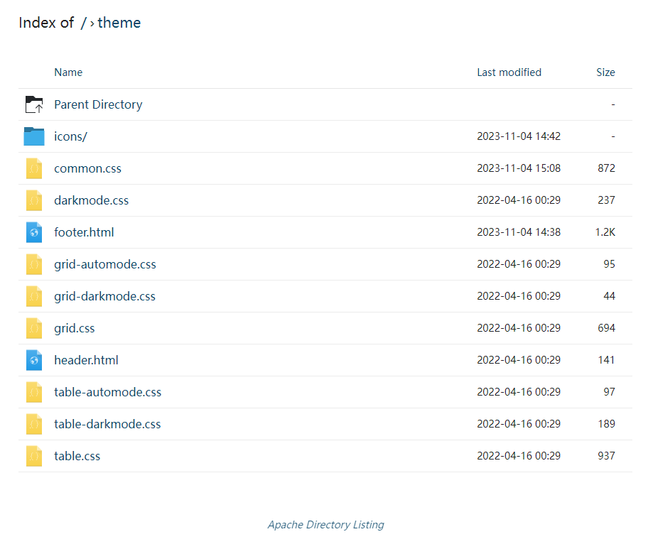

# Apache-Index-Theme

https://github.com/ramlmn/Apache-Directory-Listing

https://github.com/KDE/breeze-icons

## How to use

1. Download zip or clone the repo
2. Copy `theme` directory to `/var/www/html`
3. Copy `htaccess.txt` to same place and rename to `.htaccess`
4. Done

